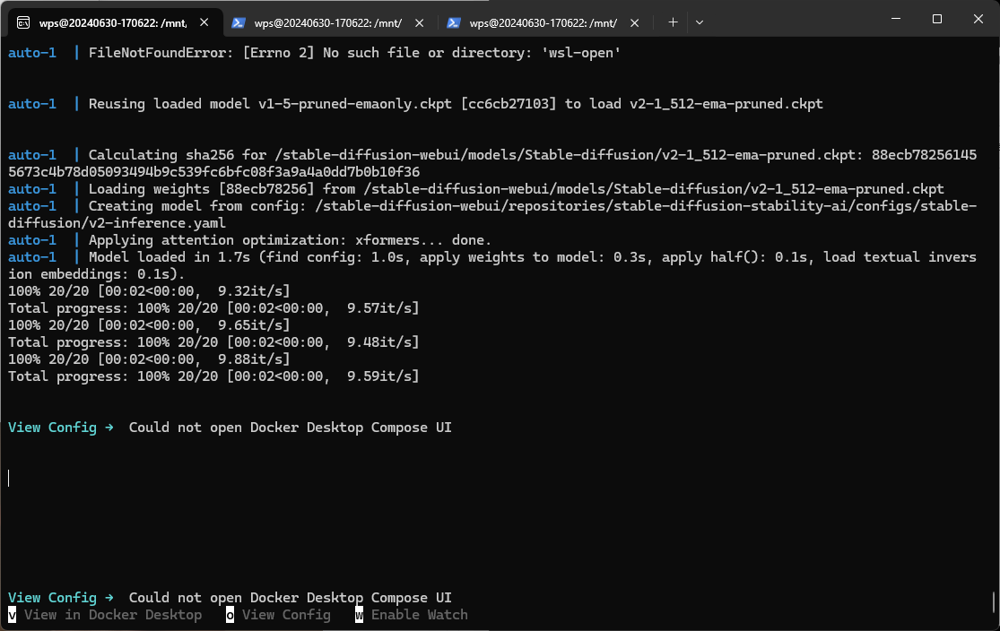
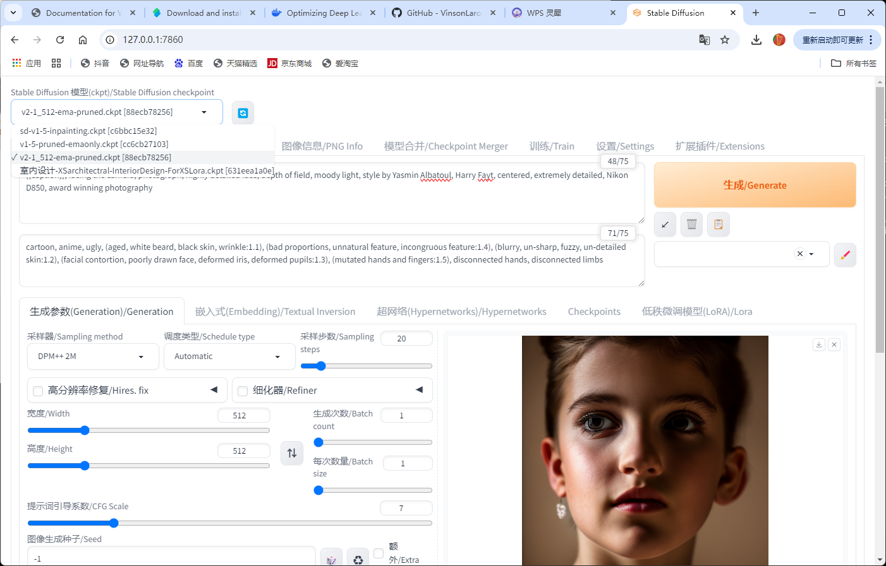
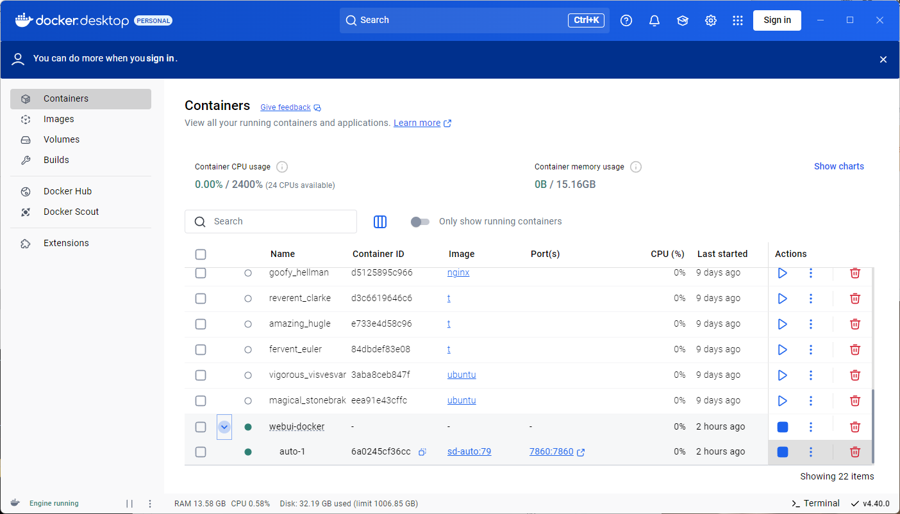

# Dependency Model Download

Recommend using Thunder to download to the corresponding directory

wget -O ./data/models/RealESRGAN/RealESRGAN_x4plus.pth https://github.com/TencentARC/GFPGAN/releases/download/v1.3.4/GFPGANv1.4.pth

wget -O ./data/models/VAE/vae-ft-mse-840000-ema-pruned.ckpt https://huggingface.co/stabilityai/sd-vae-ft-mse-original/resolve/main/vae-ft-mse-840000-ema-pruned.ckpt

wget -O ./data/models/Stable-diffusion/v2-1_512-ema-pruned.ckpt https://huggingface.co/stabilityai/stable-diffusion-2-1-base/resolve/main/v2-1_512-ema-pruned.ckpt

wget -O ./data/models/GFPGAN/GFPGANv1.4.pth https://github.com/TencentARC/GFPGAN/releases/download/v1.3.4/GFPGANv1.4.pth

wget -O ./data/models/RealESRGAN/RealESRGAN_x4plus_anime_6B.pth https://github.com/xinntao/Real-ESRGAN/releases/download/v0.2.2.4/RealESRGAN_x4plus_anime_6B.pth

wget -O ./data/models/LDSR/project.yaml https://heibox.uni-heidelberg.de/f/31a76b13ea27482981b4/?dl=1

wget -O ./data/models/LDSR/model.ckpt https://heibox.uni-heidelberg.de/f/578df07c8fc04ffbadf3/?dl=1

## Stable Diffusion WebUI Docker

docker-coompose up -d

http://127.0.0.1:7860

